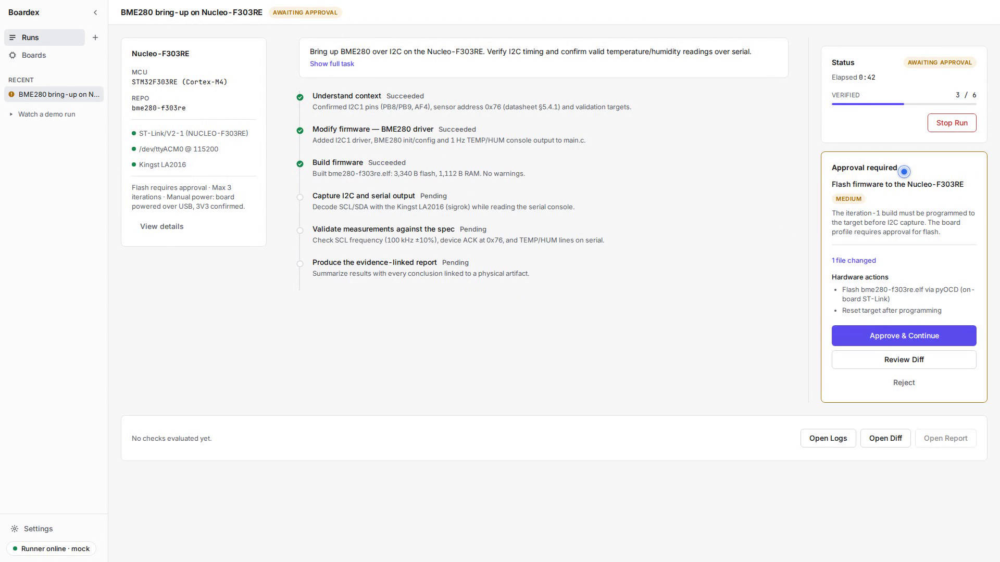

# Boardex

Boardex is an AI agent that brings up firmware on real hardware — it plans the work,
writes and builds the code, flashes the board, drives a logic analyzer, and reads the
results back. It proves what it claims: every check links to a recorded artifact (logic
captures and protocol decodes, register and memory readbacks, serial logs), and every
action that touches the board waits behind an approval gate you control.



## Install

```bash
pipx install boardex
```

*(Available after the first release. Until then, see
[Getting Started](docs/GETTING_STARTED.md#install) for the install that works today.)*

Then take the tour, or start a real run:

```bash
boardex up --demo    # a recorded run replayed in your browser
boardex up           # the real thing: runner + dashboard at http://127.0.0.1:4380
```

Both print the URL and stop on Ctrl-C.

- **No hardware needed for the demo.** `boardex up --demo` replays a recorded bring-up
  end to end — plan, approval gate, live logs, a failed measurement, the diagnosis, the
  fix, the report. It touches no hardware, calls no model, and needs no API key.
- **Keys go in the dashboard, never the terminal.** Paste your model-provider key into
  Settings → Model provider in the page that opens. The runner holds it for the session,
  write-only — nothing is written to disk and no route ever serves a key back.
- **Everything is recorded and replayable.** A run is an append-only event stream plus
  its artifacts. The validation report exports as Markdown you can attach to a PR, and
  every check in it deep-links to the capture it came from.

## Docs

- **[Getting Started](docs/GETTING_STARTED.md)** — install, the demo, your first run,
  adding hardware, troubleshooting.
- **[OS support and bench setup](docs/SUPPORT_MATRIX.md)** — what runs where, and how
  probe/analyzer access works per platform. For Kingst logic analyzers, the one-time
  [bring-up](docs/kingst-la-bringup.md).
- **[Contributing](#development)** — the design is in
  [`docs/ARCHITECTURE.md`](docs/ARCHITECTURE.md); adding an instrument is a one-file job.

## Where this is today

Early software. The loop has been run end to end on STM32 Nucleo-F303RE benches with
BMP180/BME280-class I2C sensors, an ST-Link probe, and a Kingst logic analyzer. Linux and
WSL are the primary platforms; macOS and Windows run the software fine, but hardware
access there is less exercised. Expect rough edges, and please report them.

---

# Development

## How it's built

The agent reaches real hardware through **MCP (Model Context Protocol) servers — one per
capability domain**, not one per device model:

- **`boardex-target`** — flash & debug any MCU (ST-Link, J-Link, OpenOCD, ...).
- **`boardex-logic`** — capture & decode with any logic analyzer (sigrok).
- **`boardex-scope`** — configure & measure with any oscilloscope *(planned)*.

Every server shares `boardex-core` and follows the same layered design
(Interfaces → Adapters → Registry → MCP tools). This means **you can add a new
instrument by writing a single adapter — no agent code changes.** Read the full
design in [`docs/ARCHITECTURE.md`](docs/ARCHITECTURE.md).

## Repository layout

```
boardex/
├── docs/ARCHITECTURE.md          # the design, in one page
├── boardex-app/                  # the `boardex` CLI (up / doctor), bundles the built UI
├── servers/
│   ├── boardex-core/             # shared interfaces, results, errors, registry
│   ├── boardex-target/           # MCP server: flash/debug (pyOCD backend)
│   ├── boardex-logic/            # MCP server: capture/decode (sigrok backend)
│   └── boardex-runner/           # orchestrator: agent loop + the event stream
├── packages/contract/            # the wire contract (Zod schemas → TS types + JSON Schema)
├── apps/ui/                      # the dashboard (React)
├── tools/mock-runner/            # fixture replay for UI development
└── examples/
    └── firmware/                 # minimal reference firmware to validate the tooling
        ├── blinky-f303re/        #   bare-metal flash smoke test
        └── rtt-f303re/           #   RTT logging demo (read_firmware_log)
```

> **This repo is the Boardex tooling, not a firmware archive.** Only tiny,
> clean-room reference firmware lives in `examples/firmware/` to prove the
> servers work on real silicon. Your real per-board firmware belongs in its own
> project and is handed to the agent by absolute path. A top-level `firmware/`
> directory is git-ignored as a scratch area for local work.

## Supported equipment

| Domain | Device | Status |
|---|---|---|
| Debug probe | STM32 Nucleo (onboard ST-Link) | ✅ via `boardex-target` (pyOCD) |
| Debug probe | J-Link, OpenOCD-compatible | planned (adapter) |
| Logic analyzer | Cheap Saleae clone (FX2) | ✅ via `boardex-logic` (sigrok `fx2lafw`) |
| Logic analyzer | Kingst LA2016/LA1016/LA5016/LA5032 | ✅ via `boardex-logic` (sigrok `kingst-la2016`) — needs recent libsigrok + extracted firmware |
| Logic analyzer | Kingst LA1010 | ⚠️ via `boardex-logic` — mainline sigrok lists it untested (streaming-only); [bring-up](docs/kingst-la-bringup.md) |
| Oscilloscope | Rigol, Siglent | planned via SCPI/pyvisa |

## Working from a checkout

```bash
# Python side — the four server packages, editable
pip install -e "servers/boardex-core[dev]" -e "servers/boardex-logic[dev]" \
            -e "servers/boardex-target[dev]" -e "servers/boardex-runner[dev,agent]"

# Node side — UI, contract, mock runner
npm install
npm run verify        # typecheck + lint + test across workspaces

# the CLI itself, against the tree you just built
npm run build -w apps/ui
BOARDEX_SKIP_UI_BUILD=1 pip install -e "./boardex-app[dev]"
```

`npm run dev` runs the UI and the mock runner together — the fixture-replay setup the UI
is developed against, no Python and no hardware required.

Running an MCP server directly (stdio transport), e.g. to register it with another MCP
client:

```bash
boardex-target        # flash/debug
boardex-logic         # logic analyzers (needs a system sigrok-cli on PATH)
```

See [`servers/boardex-target/README.md`](servers/boardex-target/README.md) for Nucleo
specifics (target names, udev) and how to register the server with an MCP client.

## Contributing

Adding hardware is intentionally a one-file job: implement the relevant
`boardex-core` interface as an adapter and register it. See the "How to add a new
backend" section of [`docs/ARCHITECTURE.md`](docs/ARCHITECTURE.md).

## License

Apache License 2.0 — see [`LICENSE`](LICENSE).
